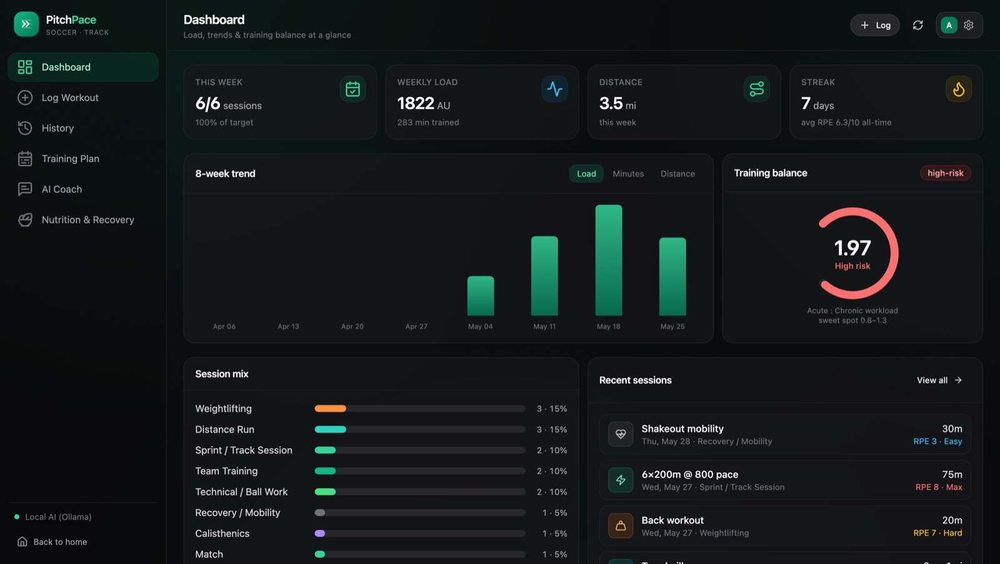

# PitchPace

[](https://github.com/rjsx197047/PitchPace/actions/workflows/ci.yml)
[](LICENSE)

Train like you mean it. A private, local-first training tracker for soccer and track athletes. Log every session, monitor your training load safely, and get AI-powered coaching—all using your own API key or a fully offline local model. Your data stays in a local SQLite file. No cloud, no account, no vendor lock-in.



## Features

- **Dashboard** — weekly load, an 8-week trend, and an acute:chronic workload ratio (ACWR) gauge to keep you out of the injury red zone.
- **Morning readiness check-in** — 60 seconds on sleep, energy and soreness (plus optional HRV/resting HR, scored against your own rolling baseline) produces a transparent 0-100 readiness score. The coach scales the day's load to it and flags soreness areas that repeat.
- **Log Workout** — matches, runs, track sessions, gym lifts, weightlifting, calisthenics, plyometrics, cross-training, boxing, recovery, and a dedicated **Testing / Benchmarks** type (40yd, vertical, broad jump, 5-10-5, beep test) — each activity with its own tailored detail fields.
- **Quick-add by voice or text** — say or type "6x400m at 70s with 2 min rest, RPE 8" and the AI fills the form for review. Works with Claude or fully offline via Ollama.
- **Import from your watch** — drop in a Garmin `.fit`/`.tcx`, Strava `.gpx`, or a full Apple Health export (`.xml`/`.zip`); PitchPace parses duration, distance, heart rate and pace, estimates RPE, and prefills the log for review.
- **AI coach with full-history memory** — chat, weekly plans, nutrition and recovery guidance. A built-in RAG layer (SQLite FTS5) retrieves your lifetime aggregates, weekly loads, personal bests and question-relevant past sessions, so answers like "compare this month to May" actually use your data.
- **Periodised toward your event** — set a target event and date; weekly plans build, sharpen, then taper into it, and the dashboard counts down.
- **Installable PWA + offline logging** — add it to your phone's home screen; the dashboard and history work offline from the last sync, and sessions logged with no signal queue locally and sync when you're back online.
- **Your data is portable** — one-click JSON / CSV export, and everything lives in a single SQLite file you can copy or delete.

## Quick start

Requires **Python 3.11+** and **Node 20+** (22 recommended).

```bash
git clone https://github.com/rjsx197047/PitchPace.git
cd PitchPace
./start.sh
# → http://localhost:8000
```

`start.sh` builds the React UI once and serves the whole app (UI + API) from one port. For development with hot reload:

```bash
./dev.sh
# Backend (FastAPI, auto-reload) on :8000
# Frontend (Vite, HMR) on :5181  ←  open this one
```

**Windows:** see [GETTING_STARTED.md](GETTING_STARTED.md), or run the steps manually:

```bat
python -m pip install -r backend\requirements.txt
cd frontend && npm install && npm run build && cd ..
python -m uvicorn app.main:app --app-dir backend --host 127.0.0.1 --port 8000
```

On first run the database is created automatically and starts empty — your stats grow as you log sessions.

## Bring your own AI key (optional)

PitchPace's AI features work two ways:

1. **Claude (recommended).** Open **Settings** (the gear icon) and paste your Anthropic API key (`sk-ant-…`). It is stored **only in your browser** and sent directly to Anthropic. Usage is billed to your own Anthropic account.
2. **Local Ollama (no key, fully offline).** Install [Ollama](https://ollama.com), pull a model (e.g. `ollama pull llama3.2`), and PitchPace uses it automatically when no Claude key is set.

A server-side fallback key can be set via `ANTHROPIC_API_KEY` (useful for a shared instance); per-request keys from the browser always take priority.

## Importing workouts

Log Workout → **Import from a watch or app**:

| Source | File | Notes |
| ------ | ---- | ----- |
| Garmin | `.fit`, `.tcx` | duration, distance, HR, calories |
| Strava / GPS apps | `.gpx` | distance computed from the track, HR from extensions |
| Apple Health | `export.zip` / `export.xml` | imports your recent workouts in bulk (review + select first) |

Single workouts prefill the log form for review; multi-workout files open a checklist so you choose what to import. Parsing happens locally — the file never leaves your machine.

## Tests

```bash
pip install -r backend/requirements.txt -r backend/requirements-dev.txt
python -m pytest backend/tests
```

CI runs the backend suite and a frontend typecheck + build on every push ([.github/workflows/ci.yml](.github/workflows/ci.yml)).

## Project structure

```
backend/     FastAPI + SQLite API (app/), importers, RAG layer, tests/
frontend/    React + Vite + Tailwind app (src/), PWA assets (public/)
website/     static marketing site (Cloudflare Pages)
scripts/     icon generation
dev.sh       dev servers with hot reload
start.sh     one-command build + serve on a single port
Dockerfile   single-image build (UI + API) for container hosts
railway.toml Railway deploy config
```

## Configuration (env vars)

| Variable             | Default                  | Purpose                                  |
| -------------------- | ------------------------ | ---------------------------------------- |
| `PITCHPACE_PORT`     | `8000`                   | API/server port (when using `run.py`)    |
| `PITCHPACE_DATA_DIR` | `backend/data`           | Where the SQLite file lives              |
| `OLLAMA_BASE_URL`    | `http://localhost:11434` | Local Ollama endpoint                    |
| `OLLAMA_MODEL`       | `llama3.2`               | Local Ollama model name                  |
| `ANTHROPIC_API_KEY`  | _(unset)_                | Optional server-side fallback Claude key |

## Deploy (optional)

**Docker:**

```bash
docker build -t pitchpace .
docker run -p 8000:8000 pitchpace      # → http://localhost:8000
```

**Railway:** create a project from this repo (it auto-detects the `Dockerfile` and `railway.toml`). Health check: `/api/health`. Attach a volume at `/app/backend/data` to persist data across deploys. A public demo has no auth — don't store private data in a shared instance.

**Marketing site (Cloudflare Pages):**

```bash
cd website && npx wrangler pages deploy . --project-name pitchpace
```

## Privacy

Local-first by design: your sessions stay in `backend/data/pitchpace.db` and your key stays in your browser. Imported watch files are parsed locally and never uploaded anywhere. See the [Privacy Policy](https://pitchpace.pages.dev/privacy.html) and [Terms](https://pitchpace.pages.dev/terms.html).

## License

[MIT](LICENSE) — fork it, modify it, self-host it.

---

© 2026 PitchPace. Provided as-is, for personal training use. Not medical advice — see the Terms. Not affiliated with Anthropic, Ollama, Garmin, Strava or Apple.
